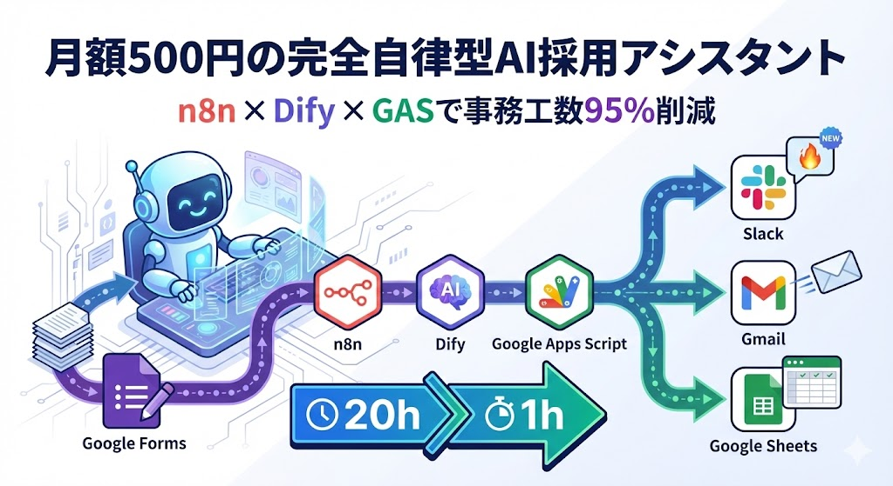
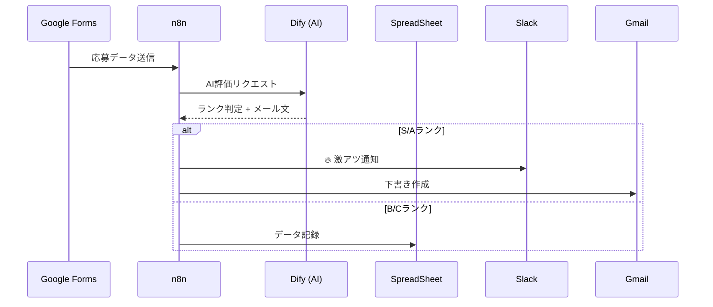

# 🤖 AI自律型採用アシスタント



n8n × Dify × GAS で構築する、月額500円の「完全自律型」採用管理システム

## 🚀 概要

このリポジトリは、Google Forms の応募データを AI が自動評価し、採用担当者の事務作業を **95% 削減** するシステムの構成ファイルを提供します。

- **開発期間**: 1日（約6時間）
- **運用コスト**: 月額約500円
- **削減効果**: 月20時間 → 月1時間（確認のみ）

## 📁 リポジトリ構成

```
.
├── docker-compose.yml      # n8n + Dify + DB 一式
├── n8n/workflows/          # 自動化ワークフローJSON
├── gas/                    # Google Apps Script コード
├── dify/prompts/           # AI評価プロンプト
├── docs/                   # 詳細ドキュメント
└── scripts/                # デプロイスクリプト
```

## ⚡ クイックスタート

### 前提条件

- ConoHa VPS（1GB RAM以上）または同等のサーバー
- Google Workspace アカウント（GAS用）
- Slack ワークスペース（通知用）
- Calendly アカウント（日程調整用）

### 1. リポジトリクローン

```bash
git clone https://github.com/YushiYamamoto/n8n-dify-recruitment-assistant.git
cd n8n-dify-recruitment-assistant
```

### 2. 環境変数設定

```bash
cp .env.example .env
# .env を編集して、各種APIキーを設定
```

### 3. Docker起動

```bash
docker-compose up -d
```

### 4. 初期設定

1. `https://your-server:5678` にアクセス
2. n8n Basic Auth でログイン
3. 「Workflows」→「Import from File」で `n8n/workflows/recruitment-automation.json` をインポート
4. Credential（Dify API, Gmail, Slack）を設定

### 5. GAS デプロイ

1. [Google Apps Script](https://script.google.com) で新規プロジェクト作成
2. `gas/spreadsheet-api.js` のコードを貼り付け
3. 「デプロイ」→「新しいデプロイ」→「Webアプリ」
4. アクセス権限: 「全員」
5. 生成されたURLを `.env` の `GAS_WEB_APP_URL` に設定

### 6. Dify 設定

1. Dify にアクセスし、新規アプリ作成（Chatflow）
2. `dify/prompts/evaluation-prompt.txt` をシステムプロンプトに設定
3. モデル: Claude 3.5 Sonnet
4. API キーを生成し `.env` に設定

### 7. Google Forms 連携

1. Google Forms を作成（項目: 名前、メール、志望動機、スキル、経験）
2. 「設定」→「プレゼンテーション」→「応答をスプレッドシートに送信」を無効化
3. 「アドオン」→「App Script」で以下のトリガー設定：

<details><summary>Google Forms トリガーGAS</summary>

```javascript
function onFormSubmit(e) {
  const formData = e.values;

  const payload = {
    name: formData[1],
    email: formData[2],
    job_type: formData[3],
    motivation: formData[4],
    skills: formData[5],
    experience: formData[6]
  };

  // n8n Webhook へ送信
  const options = {
    method: 'post',
    contentType: 'application/json',
    payload: JSON.stringify(payload)
  };

  UrlFetchApp.fetch('https://your-n8n-server/webhook/recruitment-webhook', options);
}

// トリガー設定
function createTrigger() {
  ScriptApp.newTrigger('onFormSubmit')
    .forForm(FormApp.getActiveForm())
    .onFormSubmit()
    .create();
}
```

</details>

## 🔧 動作フロー



## 💰 コスト構造

| 項目 | 月額費用 | 備考 |
|------|----------|------|
| ConoHa VPS 1GB | ¥550 | n8n Self-hosted |
| Dify API | ¥50-200 | 応募件数による |
| Google Workspace | ¥0 | 既存利用前提 |
| **合計** | **¥600-750** | 1件あたり¥15相当 |

**ROI**: 時給¥2,500 × 19時間削減 = **月¥47,500相当の効果**

## 🛠️ トラブルシューティング

| 症状 | 原因 | 解決策 |
|------|------|--------|
| Webhook 404 | パス誤り | n8nでWebhookパスを確認 |
| GAS 認証エラー | アクセス権限 | 「全員」に変更 |
| Dify タイムアウト | プロンプト長 | 要約文字数を制限 |
| Slack 通知なし | Credential 期限 | トークン再発行 |

## 🔐 セキュリティ注意事項

> [!CAUTION]
> - `.env` ファイルは絶対に GitHub にコミットしないでください
> - n8n Basic Auth パスワードは強力なものを使用してください
> - GAS Web App は「全員」に設定しても、URLが推測困難であれば安全です
> - 本番運用時は n8n の HTTPS 化（Let's Encrypt等）を必ず行ってください

## 📚 詳細ドキュメント

- [セットアップ完全ガイド](docs/setup-guide.md)
- [アーキテクチャ詳細](docs/architecture.md)

## 🤝 コントリビューション

Issue や Pull Request は大歓迎です！
以下の場合はぜひご連絡ください：
- バグ修正
- 新機能追加（ATS連携等）
- ドキュメント改善

## 📄 ライセンス

MIT License © 2026 Yushi Yamamoto

---

**本プロダクトについてのお問い合わせ・導入支援**
[株式会社プロドウガ](https://prodouga.com)までお気軽にご相談ください。
