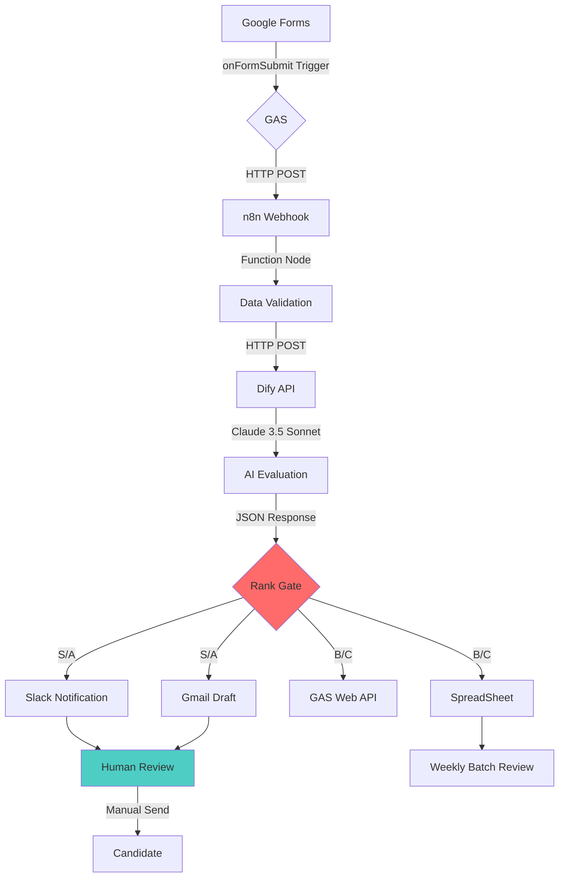

# アーキテクチャ詳細

## 設計思想

1. **低コスト**: SaaS版 n8n ではなく Self-hosted
2. **堅牢性**: GASを仲介層として、直接SpreadSheet操作を回避
3. **拡張性**: Webhook経由で、既存ATS（GreenHouse等）への接続可能
4. **人の介在**: 最終送信前の確認ステップを残す（完全無人化のリスク回避）

## データフロー詳細

## コンポーネント構成

### Docker サービス

| サービス | イメージ | ポート | 用途 |
|----------|---------|--------|------|
| n8n | n8nio/n8n:latest | 5678 | ワークフロー自動化エンジン |
| dify-api | langgenius/dify-api:latest | 5001 | AI評価API |
| db | postgres:15-alpine | 5432 | Dify用データベース |
| redis | redis:6-alpine | 6379 | Difyキャッシュ |

### 外部サービス

| サービス | 用途 | 認証方式 |
|----------|------|----------|
| Google Forms | 応募受付 | GAS トリガー |
| Google Sheets | データ記録 | GAS Web App |
| Gmail | 下書き作成 | OAuth2 |
| Slack | 通知 | Bot Token |
| Calendly | 日程調整 | URLリンク |

## エラーハンドリング戦略

各ノードで以下のエラーハンドリングを実装：

1. **Retry**: ネットワークエラー時、指数バックオフで3回リトライ
2. **Fallback**: Dify タイムアウト時、手動評価キューへ振り分け
3. **Alert**: システムエラー時、Slack 管理者チャンネルへ通知
4. **Log**: 全処理ログを SpreadSheet 別シートに記録

## パフォーマンス目標

| 指標 | 目標値 | 実測値 |
|------|--------|--------|
| 応募→評価完了 | < 30秒 | ~ 15秒 |
| 同時処理数 | 10 req/min | 検証済み |
| ダウンタイム | < 1%/月 | 目標 |
